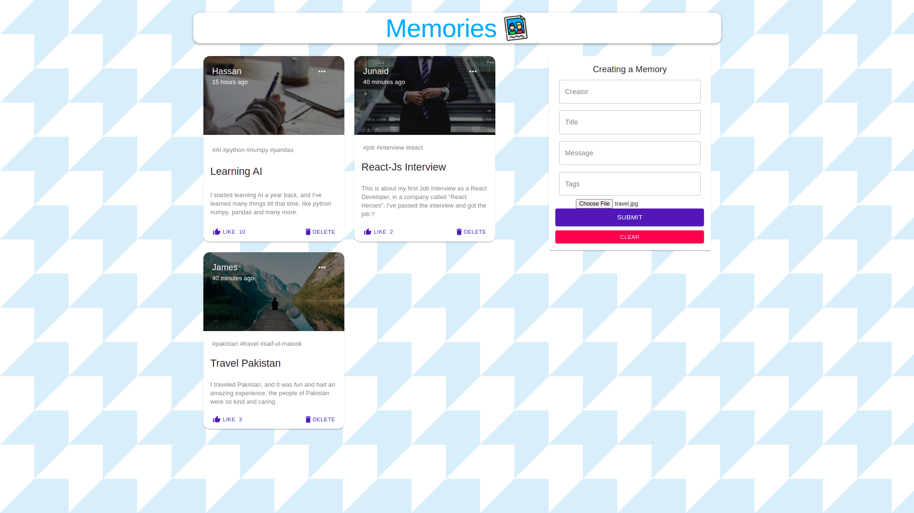
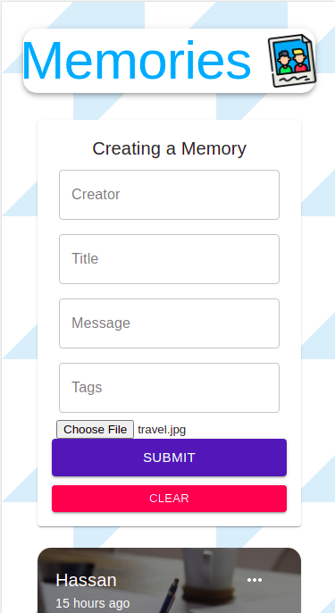
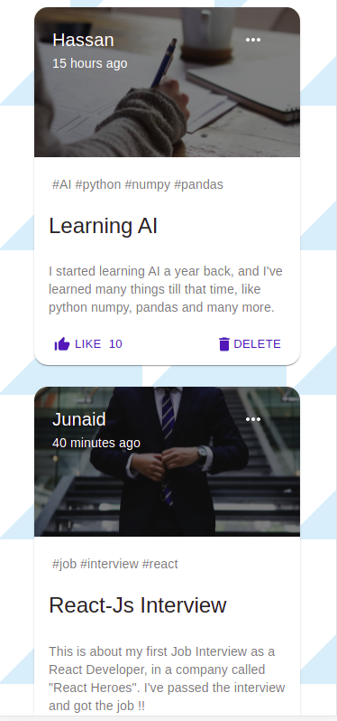

# :closed_book: Memories Manager (Full-Stack App)

### _Memories Manager Applciation, where Users can add, delete, update and like memories, and View each other's memories !!_

### Link :link: https://memories-manager.netlify.app/

### Backend Deployed at: :link: https://memories-manager.herokuapp.com/posts

## Interface

## Mobile Interface

## Run Locally

- Run this command `git clone https://github.com/developer-junaid/MERN-Memories-App.git`
- You are now in the dev environment and you can play around

## Features

- Create and Update Memories
- Like and Delete Memories
- View Other user's memories
- Mobile Responsive
- Open Source (Tweak it and use it) :)

## Tech Stack

- HTML5
- CSS3
- Javascript and ES+6
- Material-UI
- ReactJs
- Redux, Redux-Thunk
- NodeJs
- ExpressJs
- MongoDB Atlas

## Packages
- Frontend
- - axios
- - moment
- - redux
- - redux-thunk
- - @material-ui/core
- - @material-ui/icons
- - react-file-base64
- Backend
- - express
- - mongoose
- - cors
- - dotenv
- - body-parser
- - nodemon
